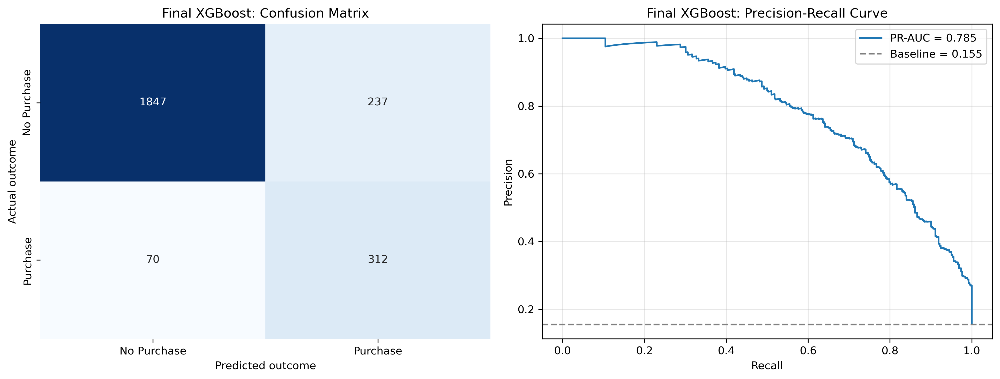
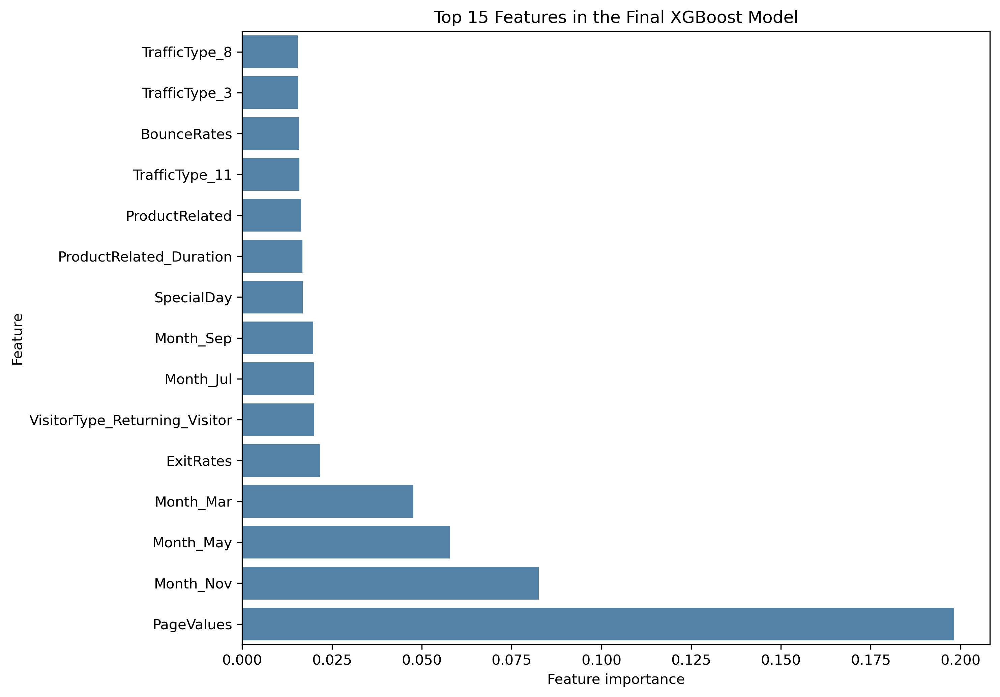

# Online Purchase Prediction

Machine learning project predicting whether an online shopping session will result in a purchase. The project uses XGBoost as its flagship model and focuses on identifying likely buyers within an imbalanced dataset.

## Project Objective

Most website sessions do not end in a purchase. The objective is to use session behaviour to distinguish purchasing sessions from non-purchasing sessions. Potential applications include customer targeting, remarketing prioritisation and website optimisation.

The model is trained on historical purchasing and non-purchasing sessions. Real-time targeting is a potential application only when all required features, particularly `PageValues`, are available when predictions are made.

## Dataset

The project uses the [Online Shoppers Purchasing Intention Dataset](https://archive.ics.uci.edu/dataset/468/online+shoppers+purchasing+intention+dataset) from the UCI Machine Learning Repository.

- 12,330 website sessions
- Numerical, categorical and Boolean session features
- Target: `Revenue`
- Purchasing sessions: approximately 15.5%
- Non-purchasing sessions: approximately 84.5%

The class imbalance means accuracy alone is not sufficient for evaluating the model.

## Project Workflow

1. Data audit and exploratory analysis
2. Train-test split with class stratification
3. Categorical feature encoding
4. Class imbalance handling with `scale_pos_weight`
5. XGBoost model development
6. Random Search
7. Grid Search
8. Manual Search
9. Final evaluation and feature importance analysis
10. Robustness check without `PageValues`

## Data Preparation and Feature Engineering

- Numerical features were retained in their original scale because tree-based XGBoost models do not require standardisation.
- Categorical variables were converted using one-hot encoding.
- The same fitted encoder was applied to training and test data.
- The split was stratified to preserve the original purchase proportion.
- Class imbalance was handled through `scale_pos_weight` rather than under-sampling, over-sampling or SMOTE.
- `Weekend` was excluded because its Boolean datatype was not captured by the original numerical or categorical selections. Its weak relationship with the target was documented as a limitation.
- `PageValues` was retained in the main model and separately assessed through a no-`PageValues` robustness check.

## Model Development

XGBoost was selected as the flagship model because it performs well on structured tabular data and can capture nonlinear relationships and feature interactions.

Hyperparameter tuning followed the required sequence:

1. **Random Search** explored a broad selection of parameter combinations.
2. **Grid Search** examined a narrower parameter grid around promising values.
3. **Manual Search** tested selected configurations based on the preceding results.

The final model uses the best Grid Search configuration. Grid Search and Manual Search used different cross-validation splits, so their scores are reported cautiously rather than treated as directly comparable.

## Final Model Performance

| Metric | Score |
|---|---:|
| Accuracy | 0.876 |
| Precision | 0.568 |
| Recall | 0.817 |
| F1-score | 0.670 |
| PR-AUC | 0.785 |

The model identified 312 of the 382 purchasing sessions in the test set. It missed 70 purchasers and incorrectly classified 237 non-purchasing sessions as purchases.



## Feature Importance

`PageValues` was the strongest feature in the final model. Month indicators, particularly November, May and March, were also influential. Exit rate, visitor type and product-related behaviour contributed additional predictive information.

Feature importance indicates how strongly a feature contributes to model decisions. It does not establish causation or show whether a feature increases or decreases purchase probability.



## Robustness Check Without PageValues

The no-`PageValues` model used the same fixed configuration as the main model. It was not independently retuned and should therefore be interpreted as a robustness check rather than the optimal model without `PageValues`.

| Metric | Without `PageValues` |
|---|---:|
| Accuracy | 0.70 |
| Precision | 0.30 |
| Recall | 0.71 |
| F1-score | 0.42 |

Performance declined substantially without `PageValues`, showing that the final model depends strongly on this feature.

## Key Findings

- The final XGBoost model achieved a PR-AUC of 0.785 compared with a positive-class baseline of approximately 0.155.
- Recall of 0.817 means the model found most purchasing sessions.
- Precision of 0.568 means that false-positive targeting remains a relevant business cost.
- `PageValues` provides substantial predictive value but limits real-time use if it is unavailable before a session ends.
- Purchase behaviour varies by month, suggesting that seasonality contributes to prediction.

## Limitations

- The test set was used during earlier model comparisons, so it should not be described as completely untouched.
- Duplicate sessions were retained and could appear across the training and test sets.
- `Weekend` was excluded because of its Boolean datatype in the original feature-selection logic.
- The no-`PageValues` model was not independently tuned.
- Real-time deployment depends on whether `PageValues` and other session features are available at prediction time.
- The dataset represents historical sessions and may not fully reflect future customer behaviour.

## Repository Structure

```text
online-purchase-prediction/
├── data/
│   ├── raw/
│   └── processed/
├── notebooks/
│   ├── 01_data_audit_eda.ipynb
│   └── 02_preprocessing_modelling_final.ipynb
├── reports/
│   └── figures/
│       ├── final_model_evaluation.png
│       └── final_model_feature_importance.png
├── src/
└── README.md
```

## Running the Project

1. Clone the repository:

```bash
git clone https://github.com/Azaffe82/online-purchase-prediction.git
cd online-purchase-prediction
```

2. Install the required Python packages:

```bash
pip install pandas numpy matplotlib seaborn scikit-learn xgboost
```

3. Open and run the notebooks in this order:

```text
notebooks/01_data_audit_eda.ipynb
notebooks/02_preprocessing_modelling_final.ipynb
```

## Presentation

[View the project presentation in Google Slides](https://docs.google.com/presentation/d/1ndZUwfda2W1RuMFlGI5eKW_G3bWMqH4D/edit?usp=sharing)

## Team

- Andrea Zaffe
- Berker Ildokuz
